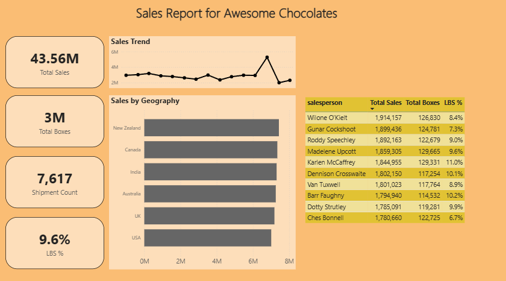
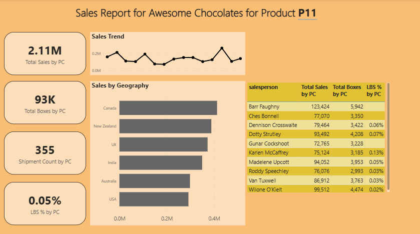

# Notes

## Intro

This is a Power BI dashboard project that connects to a PostgreSQL database. The project is based on an imaginary chocolate company. The dashboard displays the following:

- Total Sales,
- Total Boxes Sold,
- Shipment Count,
- Percentage of Sales with the Low Number of Boxes,
- Sales Trend,
- Sales by Geography,
- and Top 10 Salespeople Ordered by the Amount of Sales.

Another dashboard shows the sales by a specific chocolate product:

The project could be coded along following this video:  
[How to use SQL with Power BI](https://www.youtube.com/watch?v=UQJAHUUFK-o)

My code differs from the video, as I implemented this project in PostgreSQL, whereas the tutorial is based on a different SQL Database Management System.

## Project Details

The key steps involved in this project are:

- Setting up a PostgreSQL database,
- Creating 4 tables and adding relevant data with `INSERT` statements,
- Brief exploration of the data using `SELECT` statements,
- Connecting a Power BI file to the database,
- Changing the background color of the page in Power BI,
- Adding Card, Line, Stacked Bar Chart, and Table visuals,
- Adding a Text box with a dynamic text that changes with data,
- Using DAX to create several explicit measures,
- Writing a SQL query in Power BI to import specific data, and
- Parameterizing the SQL code in Power Query to easily change the data imported from the database
